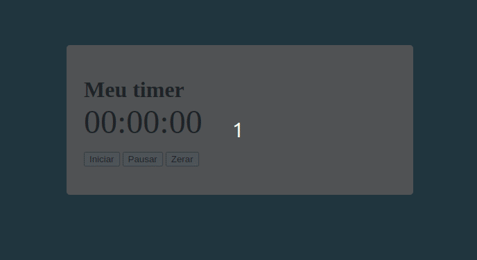

<h1 align='center'>Marcador de tempo</h1>
<h1 align="center">⏳</h1>

Este é um simples **aplicativo de timer** criado com **HTML, CSS e JavaScript**. Ele permite que você acompanhe o tempo decorrido e realize ações como iniciar, pausar e zerar o cronômetro.

  

